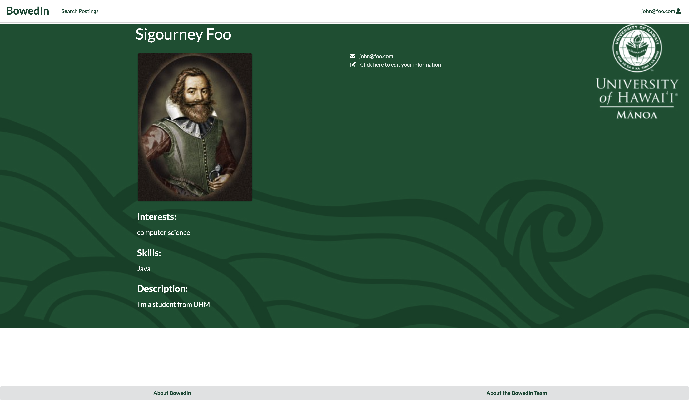
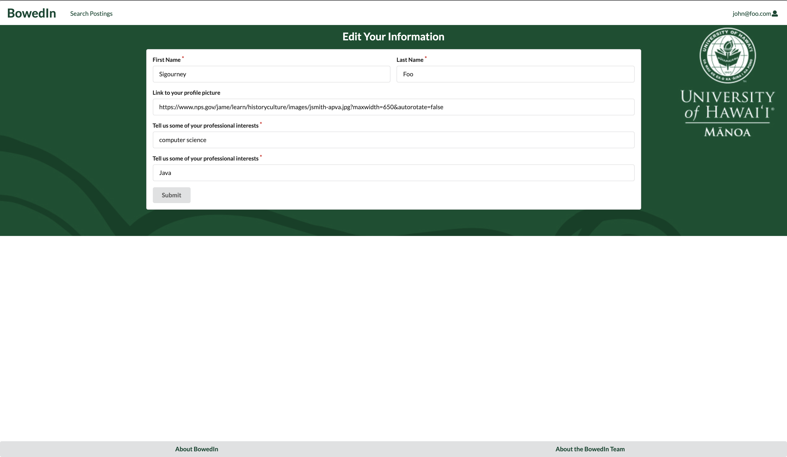
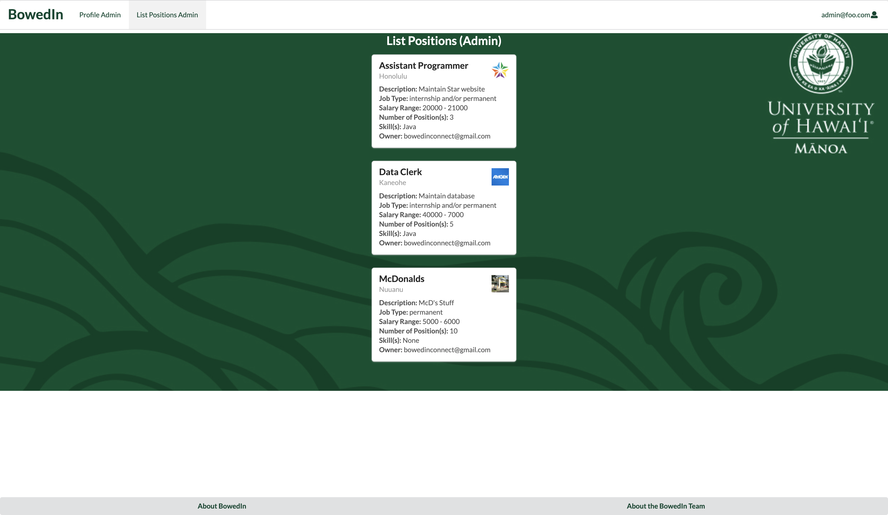

## Table of contents

* [Overview](#overview)
* [Deployment](#deployment) 
* [User Guide](#user-guide)
* [Developer Guide](#developer-guide)
* [Initialization](#initialization)
* [Development History](#development-history)
* [Team](#team)
* [Deployment](#deployment) 
* [Community Feedback](#community-feedback)
* [Developer Guide](#developer-guide)
* [Development History](#development-history)
* [Continuous Integration](#continuous-integration)

## Overview

BowedIn is an application that helps connect UH computer science students to desired local software engineering and tech companies and employers. On this app, they will be able to find internships, volunteering, and many other job opportunities that suits their specialty and goals, including:

* Software engineering
* Game/Web Design
* Data Science
* Computer Graphics
* System Analytics
* Artificial Intelligence
* Specific programming languages: Java, JavaScript, C/C++, Python, R

and more! Conversely, employers will be able to recruit students from this app as well based on their listed areas of interests and experience. They may be able to connect with each other by sending an add request. 

Our goal is to work closely as a team and develop a functional and aesthetically pleasing website. 

## Deployment

A live deployment of BowedIn is available [here](https://bowedin.com/#/).


## User Guide

This section provides a walkthrough of the (current) BowedIn user interface and its capabilities.

### Landing Page

The landing page is presented to users when they visit the top-level URL to the site.


### Sign in and sign up

<!--##EDIT  -->

Click on the "Login or Sign Up Today!" button in the upper right corner of the navbar, then select "Sign in" to go to the Sign In page. You must have been previously registered with the system to use this option. 


Alternatively, you can select "Sign up" to go to the following page and register as a new user. BowedIn allows different types of users: student and company. These differences manifest in what the user (student or company) is able to see and use within the application. Below is the signup process.

First, after pressing on 'Uh oh, I don't have an account!' or by pressing the 'Login or Sign Up Today!' dropdown menu and indicating 'Sign Up', the user is directly transferred to the preliminary sign up page. This page, pictured below, creates a Meteor account assigned to that user and depending on their choice of 'Student' or 'Company' in the drop down an additional form will be rendered that collects additional information about the user.


After the preliminary signup page is completed, one of two pages will be rendered: an additional form collecting information about student users:


Or a form that collects more information about company users.


### Home Page

BowedIn is has three different home pages depending on the role: Student, Company, and Admin.

After the account is set up and the UHM student user logs in, you are taken to the student home page.


After the account is set up and the company user logs in, you are taken to the company home page.


Using the preassigned credentials, after the admin user logs in, you are taken to the admin home page. 


### Profile page

After logging in, you are taken to the home page, which presents a form where you can complete and/or update your personal profile:



From your personal profile page, you can click "click here to edit your information". You will then be brought up to a form where you can edit your information:




### Add Position page

The Add Position page can only be accessed by a user with the company role and renders a form to add create a new position into the database. 


### Search page

The Search page provides the ability to query the database and display the results in the page. In this case, the query displays all of the postings that match one or more of the specified fields, such as location, skill(s), position name, etc. Notice that on each listing there is a message field. This will allow student users to send a message to the owner of the listing (i.e the company who published the position). BowedIn.com will also send a copy of the student's message as an email to the email associated with the company user's account. See the Additional Functionality section below for a preview of a sample email.


### Recruit page

The Search page provides the ability to query the database and display the results in the page. In this case, the query displays all of the postings that match one or more of the specified fields, such as location, skill(s), position name, etc. Notice that on each listing there is a message field. This will allow student users to send a message to the owner of the listing (i.e the company who published the position). BowedIn.com will also send a copy of the student's message as an email to the email associated with the company user's account. See the Additional Functionality section below for a preview of a sample email.


### Admin Profiles page

From the admin home page, the admin user can either go to the navigation bar's "Profile Admin" or press the "List Users" on the home page to be redirected to a page that lists all users in the database. 


### Admin Positions page

From the admin home page, the admin user can either go to the navigation bar's "List Positions Admin" or press the "List Positions" on the home page to be redirected to a page that lists all positions in the database. 



### About Us Page

When the user clicks on the 'About the BowedIn Team' button in the footer the follwoing page displays links to the BowedIn team members' individual professional portfolios. Additionally, if the user clicks on the 'About BowedIn' button, the user is redirected to the BowedIn GitHubIO page.


### Additional Functionality: Messaging between students and companies

BowedIn offers the oppurtunity for students and companies to message each other. A user can send a date and time stamped message. The recipient can review the message from their home page. Additionally, the recipient will receive a copy of the message from the email account: 'bowedinconnect@gmail.com'. Pictured below is an email sent from BowedIn.com to a sample user with the message 'test message 3'.


## Community Feedback

**Anonymous User 1 – Feedback**<br/>
*The indeed picture looks like it came out of nowhere. I think the background could also be improved. The messages also don't show who they came from. However, I like the idea and the interface is simple and intuitive.*

Hello and thank you for your feedback! The BowedIn team is happy to inform you that as of May 12th, 2021, the messages now include a header that indicates who sent the message.

**Anonymous User 2 – Feedback**<br/>
*I like how the footer is moving with the screen, email links to the mail application, presentation is very organized. I think you can improve on messages box (since it's just a white box maybe add a text saying no message), not sure about the purpose of message button.*

Thank you for your feedback! The BowedIn team is happy to inform you that as of May 12th, 2021, the messages will no longer have just a plain white box. If there are no messages, the home pages now present a message 'No new messages' if the user does not have any messages. 

**Anonymous User 3 – Feedback**<br/>
*You should change interests to skills on the registration form to better reflect the profile card. The NavBar is confusing. I wish you had a home page or about us page that describes what the website does after you sign up/in. I don't know if the BowedIn link at the top is supposed to direct me to my profile page or my home page, and it almost looks like it's neither. Also what is the message button supposed to do?*

Thank you for your thorough feedback! An information page is currently in the works right now and the team is currently brainstorming on how to make the navigation bar and home pages more clear. 

**Anonymous User 4 – Feedback**<br/>
*Some of the buttons don't actually do anything. The message button when you log in will not message anyone, but when you type something then press submit, it will work. The home pages look nice though. I also like the moving footer.*

Thank you for your feedback and we will fixed it after our next development release. 

**Anonymous User 5 – Feedback**<br/>
*I like the green and all the background visuals. It gives it a nice feel to it. However, most of the buttons don't work and some of the pages feel empty. The signin and register pages could use something to make it feel less empty.*

We are happy to hear you like the green and mahalo for your feedback! The BowedIn team is currently brainstorming to make the sign-in and register pages look better.  

**Anonymous User 6 - Feedback**<br/>
*The Landing page looks nice! Very clean and modern UI. I enjoyed the animated buttons - very cool! Overall the app is very easy to use. It is however not very intuitive to use. I found myself confused and not certain what the exact point of the app was. An introduction page could be useful. Additionally if I were a student, I think it would be cool to have more control over the search filter on the search page. Overall great job on the app!*

Thank you for your feedback! An information page is currently in the works right now to make the website as a whole more intuitive. We agree that it would be cool and it would be a great addition for future implementations. 

## Developer Guide

This section provides information of interest to Meteor developers wishing to use this code base as a basis for their own development tasks.

### Installation

First, [install Meteor](https://www.meteor.com/install).

Second, visit the [BowedIn application github page](https://bowed-in.github.io/), and click the "Use this template" button to create your own repository initialized with a copy of this application. Alternatively, you can download the sources as a zip file or make a fork of the repo.  However you do it, download a copy of the repo to your local computer. Now you are able to edit the BowedIn code within your very own copy of BowedIn.

Third, cd into the bowed-in/app directory and install libraries with:

```
$ meteor npm install
```

Fourth, run the system with:

```
$ meteor npm run start
```

If all goes well, the application will appear at [http://localhost:3000](http://localhost:3000).

### Application Design

BowedIn is based upon [meteor-application-template-react](https://ics-software-engineering.github.io/meteor-application-template-react/) and [meteor-example-form-react](https://ics-software-engineering.github.io/meteor-example-form-react/). Please use the videos and documentation at those sites to better acquaint yourself with the basic application design and form processing in BowedIn.


### Data model

BowedIn relies on the use of two collections: UsersColection and PositionsCollection. As noted above, BowedIn allows multiple roles: student and company. In order to acheive this separation, we have utilized the UsersCollection to store data regarding student and company user data.

Additionally, the PositionsCollection allows input into the positions database. The 'owner' of a position entry will be limited to comapny users. The 'owner' field will serve as the foreign key and will be user to retrieve data in the collection associated with a certain 'company' user.


## Initialization

The [config](https://github.com/bowed-in/bowed-in/tree/master/config) directory is intended to hold settings files.  The repository contains one file: [config/settings.development.json](https://github.com/bowed-in/bowed-in/blob/master/config/settings.development.json).

This file contains default definitions for Users and Positions.

#### ESLint

BowedIn includes a [.eslintrc](https://github.com/bowed-in/bowed-in/blob/master/app/.eslintrc) file to define the coding style adhered to in this application. You can invoke ESLint from the command line as follows:

```
meteor npm run lint
```

Here is sample output indicating that no ESLint errors were detected:

```
$ meteor npm run lint

> bowed-in@ lint /Users/philipjohnson/github/bowed-in/bowed-in/app
> eslint --quiet --ext .jsx --ext .js ./imports ./tests

$
```

ESLint should run without generating any errors.

It's significantly easier to do development with ESLint integrated directly into your IDE (such as IntelliJ).

#### End to End Testing

Currently BowedIn has succesfully tested all pages within the app and uses [TestCafe](https://devexpress.github.io/testcafe/) to provide automated end-to-end testing.

## Test Badge


The BowedIn end-to-end test code employs the page object model design pattern.  In the [bowedin tests/ directory](https://github.com/bowed-in/bowed-in/tree/master/app/tests), the file [tests.testcafe.js](https://github.com/bowed-in/bowed-in/blob/master/app/tests/tests.testcafe.js) contains the TestCafe test definitions. The remaining files in the directory contain "page object models" for the various pages in the system as well as one component (navbar). This organization makes the test code shorter, easier to understand, and easier to debug.

To run the end-to-end tests in development mode, you must first start up a BowedIn instance by invoking `meteor npm run start` in one console window.

Then, in another console window, start up the end-to-end tests with:

```
meteor npm run testcafe-development
```

You will see browser windows appear and disappear as the tests run.  If the tests finish successfully, you should see the following in your second console window:

```
$ meteor npm run testcafe-development


> meteor-application-template-react@ testcafe-development /Users/justinloi/Documents/GitHub/jmcloi/bowed-in/app
> testcafe chrome tests/*.testcafe.js

 Running tests in:
 - Chrome 90.0.4430.85 / macOS 10.15.7

 BowedIn localhost test with default db
 ✓ Test that landing page shows up (unstable)
 ✓ Test that landing page shows up
 ✓ Test that student signin and signout work
 ✓ Test that company signin and signout work
 ✓ Test that admin signin and signout work
 ✓ Test that student signup process works, then logout works
 ✓ Test that company signup process works, then logout works
 ✓ Test that edit student user information process works then logout
 ✓ Test that edit company user information process works then logout
 ✓ Test the View Profile Page
 ✓ Test the View Admin Profile Page from Nav Bar
 ✓ Test that student home page is reachable
 ✓ Test that company home page is reachable
 ✓ Test that admin home page is reachable
 ✓ Test the List Users from Admin Home Page
 ✓ Test the List Positions from Admin Home Page
 ✓ Test the search posting page
 ✓ Test that the user gets redirected to the BowedIn github.io page when they click About BowedIn in the footer
 ✓ Test that the user gets redirected to the BowedIn About Us page when they click About the BowedIn Team in the footer
 ✓ Test that the List Student page shows up
 ✓ Test messaging from student to company and that the delete button works
 ✓ Test messaging from company to student and that the delete button works


 21 passed (23m 46s)

 $
```

You can also run the testcafe tests in "continuous integration mode".  This mode is appropriate when you want to run the tests using a continuous integration service like Jenkins, Semaphore, CircleCI, etc.  In this case, it is problematic to already have the server running in a separate console, and you cannot have the browser window appear and disappear.

To run the testcafe tests in continuous integration mode, first ensure that BowedIn is not running in any console.

Then, invoke `meteor npm run testcafe`.  You will not see any windows appear.  When the tests finish, the console should look like this:

```
$ meteor npm run testcafe


> meteor-application-template-react@ testcafe-development /Users/justinloi/Documents/GitHub/jmcloi/bowed-in/app
> testcafe chrome tests/*.testcafe.js

 Running tests in:
 - Chrome 90.0.4430.85 / macOS 10.15.7

 BowedIn localhost test with default db
 ✓ Test that landing page shows up (unstable)
 ✓ Test that landing page shows up
 ✓ Test that student signin and signout work
 ✓ Test that company signin and signout work
 ✓ Test that admin signin and signout work
 ✓ Test that student signup process works, then logout works
 ✓ Test that company signup process works, then logout works
 ✓ Test that edit student user information process works then logout
 ✓ Test that edit company user information process works then logout
 ✓ Test the View Profile Page
 ✓ Test the View Admin Profile Page from Nav Bar
 ✓ Test that student home page is reachable
 ✓ Test that company home page is reachable
 ✓ Test that admin home page is reachable
 ✓ Test the List Users from Admin Home Page
 ✓ Test the List Positions from Admin Home Page
 ✓ Test the search posting page
 ✓ Test that the user gets redirected to the BowedIn github.io page when they click About BowedIn in the footer
 ✓ Test that the user gets redirected to the BowedIn About Us page when they click About the BowedIn Team in the footer
 ✓ Test that the List Student page shows up
 ✓ Test messaging from student to company and that the delete button works
 ✓ Test messaging from company to student and that the delete button works


 21 passed (23m 46s)


$
```

## Continuous Integration


BowedIn uses [GitHub Actions](https://docs.github.com/en/free-pro-team@latest/actions) to automatically run ESLint and TestCafe each time a commit is made to the default branch.  You can see the results of all recent "workflows" at [https://github.com/bowed-in/bowed-in/actions](https://github.com/bowed-in/bowed-in/actions).

The workflow definition file is quite simple and is located at
[.github/workflows/ci.yml](https://github.com/bowed-in/bowed-in/blob/master/.github/workflows/ci.yml).


## Development History

The development process for BowedIn conformed to [Issue Driven Project Management](http://courses.ics.hawaii.edu/ics314f19/modules/project-management/) practices. 

* Development consists of a sequence of Milestones.
* Each Milestone is specified as a set of tasks.
* Each task is described using a GitHub Issue, and is assigned to a single developer to complete.
* Tasks should typically consist of work that can be completed in 2-4 days.
* The work for each task is accomplished with a git branch named "issue-XX", where XX is replaced by the issue number.
* When a task is complete, its corresponding issue is closed and its corresponding git branch is merged into master.
* The state (todo, in progress, complete) of each task for a milestone is managed using a GitHub Project Board.

The following sections document the development history of BowedIn.

### Milestone 1: Mockup development

The goal of Milestone 1 was to create a set of HTML pages providing a mockup of the pages in the system.

Milestone 1 was managed using [BowedIn GitHub Project Board M1](https://github.com/bowed-in/bowed-in/projects/1):

### Milestone 2: Data model development

The goal of Milestone 2 was to implement the data model: the underlying set of Mongo Collections and the operations upon them that would support the BowedIn application.

Milestone 2 was managed using [BowedIn GitHub Project Board M2](https://github.com/bowed-in/bowed-in/projects/2):

## Milestone 3: Final touches

The goal of Milestone 3 was to clean up the code base and fix minor UI issues.

Milestone 3 was managed using [BowedIn GitHub Project Board M3](https://github.com/bowed-in/bowed-in/projects/3):

## Team

BowedIn is designed, implemented, and maintained by [Justin Honda](https://jhonda7.github.io/), [Justin Loi](https://justin-loi.github.io/), [Sara Cheng](https://sara-2c.github.io/), [Jackie Wu](https://jwu0.github.io/).
